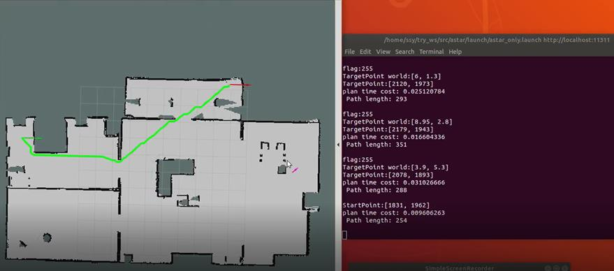

>We implemented a path planning package for a turtlebot
in a pre-mapped environment.

This is a project of AU336(mobile robotics) of SJTU.

We implemented the **A* algorithm** in ROS with both C++ and Python to compare their
efficiency. And we smoothed
the path based on the **Floyd path smoothing algorithm**. Then, an interactive
interface in **Rviz** was developed to enable us testing the algorithms.

<!-- - Implemented the **A* algorithm** in ROS with both C++ and Python.
- Smoothed the path based on the **Floyd path smoothing algorithm**.
- Developed an interactive interface in Rviz.
- Compare the efficiency between C++ and Python implementation. -->

---
[Back to project Page](/project/)
