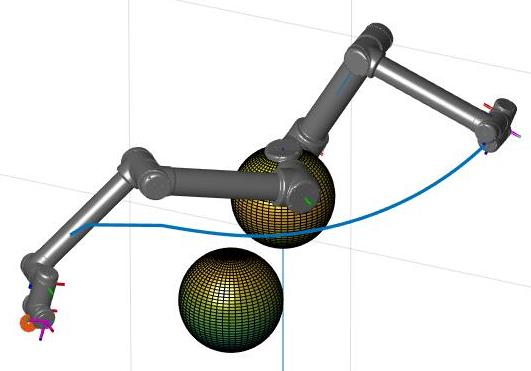
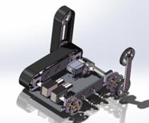
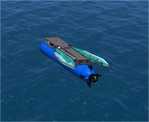

<!-- 
## Path Planning
In this project, we implemented a **path planning package** for a turtlebot
in a pre-mapped environment.

- Implemented the **A* algorithm** in ROS with both C++ and Python.
- Smoothed the path based on the **Floyd path smoothing algorithm**.
- Developed an interactive interface in Rviz.
- Compare the efficiency between C++ and Python implementation.

---

## Navigation
In this project, we accomplished a stacking task with a UR-10 manipulator in
MATLAB/Simulink.

- Implemented the **(inverse) kinematic and dynamic methods** of UR-10 manipulators
based on POE.
- Designed an **artificial potential field** algorithm with **self-collision avoidance**
for path planning.
- Developed the trajectory planning with **cubic splines** based on **dynamic programming**. -->

  

    
  

  

    <h2>Navigation for UR-10 manipulators</h2>
    <!-- <a href="link_to_paper" class="paper-link">Paper</a> -->
    

      <!-- <a href="link_to_related_content" class="keyword">Paper</a> -->
      <a class="keyword">Manipulator</a>
      <a class="keyword">Navigation</a>
      <!-- Add more keywords as needed -->
    

    Implemented a navigation system for UR-10 manipulator and verified on Simulink; enhanced self-collision avoidance based on artificial potential field algorithms.
    
  

  

    
  

  

    <h2>A tracked vehicle for obstacle climbing</h2>
    <!-- <a href="link_to_paper" class="paper-link">Paper</a> -->
    

      <!-- <a href="link_to_related_content" class="keyword">Paper</a> -->
      <a class="keyword">Obstacle Climbing</a>
      <a class="keyword">Robot System Design</a>
      <!-- Add more keywords as needed -->
    

    Designed and prototyped an double-tracked robot for obstacle climbing.
    
  

  

    
  

  

    <h2>A* Path Planning for Mobile Robots</h2>
    <!-- <a href="link_to_paper" class="paper-link">Paper</a> -->
    

      <!-- <a href="link_to_related_content" class="keyword">Paper</a> -->
      <a class="keyword">A*</a>
      <a class="keyword">Path Planning</a>
      <a class="keyword">ROS</a>
      <!-- Add more keywords as needed -->
    

    Implemented A* path planning algorithm for navigation of mobile robot in ROS with both C++ and Python.
    
  

  

    
  

  

    <h2>Foldable Wave Energy Capturing Robot</h2>
    <!-- <a href="link_to_paper" class="paper-link">Paper</a> -->
    

      <!-- <a href="link_to_related_content" class="keyword">Paper</a> -->
      <a class="keyword">Robotics System Design</a>
      <a class="keyword">Autonomous Underwater Vehicle</a>
      <a class="keyword">Wave Dynamics</a>
      <a class="keyword">Simulink</a>
      <!-- Add more keywords as needed -->
    

    Designed and tested an AUV with foldable wings for self-energy supply exploiting wave energy.
    
  

