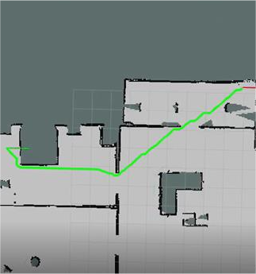
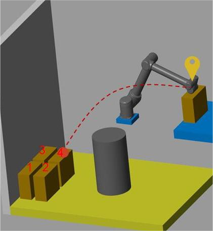

<!-- 
## Path Planning
In this project, we implemented a **path planning package** for a turtlebot
in a pre-mapped environment.

- Implemented the **A* algorithm** in ROS with both C++ and Python.
- Smoothed the path based on the **Floyd path smoothing algorithm**.
- Developed an interactive interface in Rviz.
- Compare the efficiency between C++ and Python implementation.

---

## Navigation
In this project, we accomplished a stacking task with a UR-10 manipulator in
MATLAB/Simulink.

- Implemented the **(inverse) kinematic and dynamic methods** of UR-10 manipulators
based on POE.
- Designed an **artificial potential field** algorithm with **self-collision avoidance**
for path planning.
- Developed the trajectory planning with **cubic splines** based on **dynamic programming**. -->
**Mechanism Design**
- [A tracked vehicle for obstacle climbing](/research/tracked/)
- [Wave energy capturing mechanism](/research/mechanism/)

**Control and Planning**
- [Path Planning for mobile robots](/research/path-plan/)
- [Navigation for UR-10 manipulators](/research/ur10-nav/#navigation)

---
