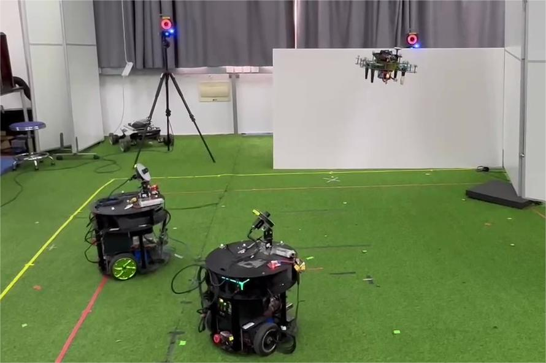

> We proposed a task scheduling and motion control method for unmmaned ground vehicle (UGV)
teams to conduct active vision missions collaboratively.

This is my Bachelor's graduation project. It was conducted in the laboratory of Cooperative Intelligence of
Unmanned Systems (CIUS) led by <a href="https://me.sjtu.edu.cn/teacher_directory1/dongwei2.html">Prof. Wei Dong</a>.
We hope to guarantee safe navigation of aerial vehicles with UGVs' vision systems. In this way, the perception
payload of UAVs can be removed and endurance can be improved. We scheduled UGVs' perception tasks based on
<b>distributed task allocation</b> methods and utilized <strong>active vision</strong> strategies to optimize camera views.

---
### Overview

In the above picture, two UGVs are localizing a UAV with their onboard cameras meanwhile detecting surrounding hazardous obstacles.
  
More details of the project are not available currently.

---
[Back to Research Page](/research/)
