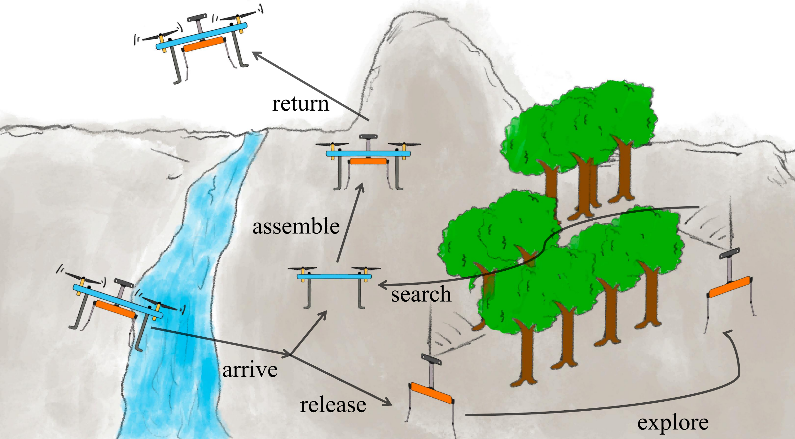
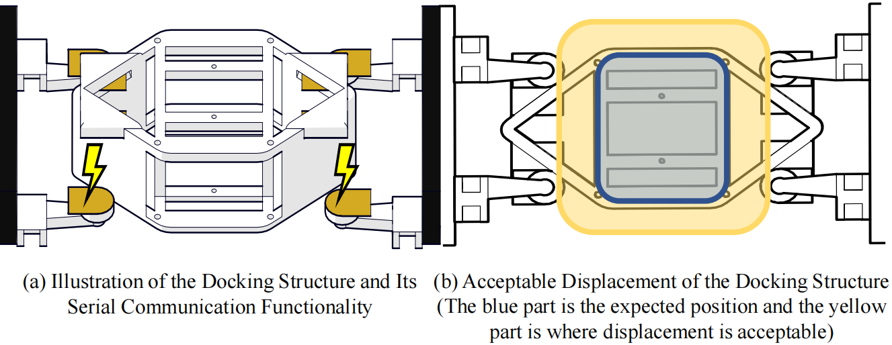

<!-- 0. this unordered seed list will be replaced by toc as unordered list
{:toc} -->
>Collaboration of an unmanned aerial vehicle (UAV) and a quadruped robot to conduct
exploration tasks in flight-impeded zones.

This research was conducted in the laboratory of Cooperative Intelligence of
Unmanned Systems (CIUS) led by [Prof. Wei Dong](https://me.sjtu.edu.cn/teacher_directory1/dongwei2.html).
Aiming at exploration and rescue
tasks in flight-impeded areas, we designed an **integrated quadruped-hexarotor system**.
UAVs are flexible and efficient in transporting the ground vehicle to the task spot,
and quadruped robots are of high adaptiveness in complex environments. The
collaboration can combine the advantages of aerial and quadruped vehicles.

---
### Collaboration Process

As illustrated in the cartoon picture above, the hexarotor delivers the quadruped
over ground obstacles to somewhere near task sites and **releases** it. Then the quadruped
conducts **exploration** tasks in complex flight-impeded areas while the UAV remains unmoved.
After the mission, the
quadruped **searches** for the hexarotor via onboard localization and vision systems,
**assembling** the two robots for return. Only one onboard computer carried by the quadruped is
utilized during the whole process, reducing the overall weight and cost.

---
### System Design
[Read our Paper](https://ieeexplore.ieee.org/abstract/document/9665137)

In transportation, the UAV and the quadruped robot are closely contacted. We exploited
this and developed an **adaptive docking system**, with which the the AUV can capture
the quadruped without requiring high localization accuracy. And
this system enabled two vehicles to **share computing resources** with four electrodes
for serial communication.

We also implemented a **vision-based remote localization package** to enable the
quadruped finding the hexarotor quickly after the tasks finish. Details of the
system can be found in our published paper [in 2021 IEEE M2VIP](https://ieeexplore.ieee.org/abstract/document/9665137).

---
### Control
[Read our paper](http://arxiv.org/abs/2209.08209)

In the above collaborative system, the quadruped brings mass-inertia uncertainty
to the whole transportation system, because it might deploy sensors or carry samples
with it. Hence, the performance of flight is greatly affected. To tackle this
problem, we designed an **adaptive controller** for transportation. The proposed method
**rejects external disturbances** such as wind with compensation and **estimates uncertain**
**mass-inertia parameters**. It exceeds other methods in its smoothness and convergence
rate. The paper can be seen in [arXiv](http://arxiv.org/abs/2209.08209).

---
[Back to Research Page](/research/)
