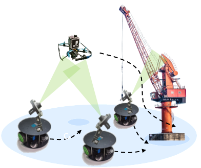
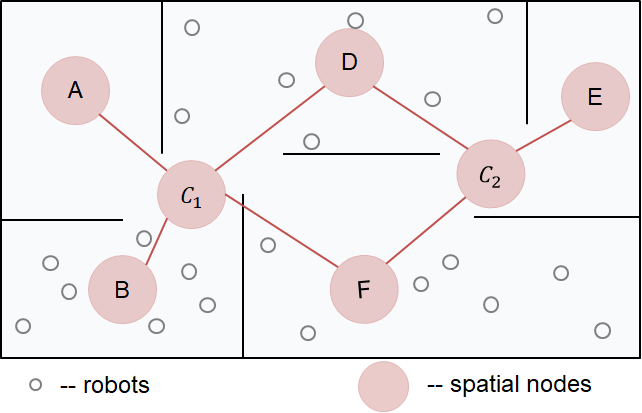
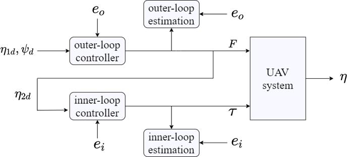

## Current Work

  

    
  

  

    <h2>Action Advising for Efficient RL in Ad Hoc Teaming</h2>
    <!-- <a href="link_to_paper" class="paper-link">Paper</a> -->
    

      <a class="keyword">Reinforcement Learning</a>
      <a class="keyword">Transfer Learning</a>
      <a class="keyword">Multi-Agent</a>
      <!-- Add more keywords as needed -->
    

    Supervised by <a href="https://www.ri.cmu.edu/ri-faculty/katia-sycara/">Prof. Katia Sycara</a>.
    Develop policy transfer strategy based on action advising to enhance reinforcement learning efficiency in multi-agent ad hoc teaming.
  

---
## Past Work

  

    
  

  

    <h2>Active Vision of Coordinated Ground Vehicle Systems</h2>
    <!-- <a href="link_to_paper" class="paper-link">Paper</a> -->
    

      <!-- <a href="link_to_related_content" class="keyword">Paper</a> -->
      <a class="keyword">Multi-Robot</a>
      <a class="keyword">Planning and Control</a>
      <a class="keyword">Active Vision</a>
      <a class="keyword">Localization</a>
      <!-- Add more keywords as needed -->
    

    Scheduled active vision tasks for a UGV team to enhance vision-based localization of an aerial vehicle for safe navigation.
    
  

  

    
  

  

    <h2>Efficient Large-Scale Team Behavior Manipulation</h2>
    <!-- <a href="link_to_paper" class="paper-link">Paper</a> -->
    

      <a class="keyword">Multi-Agent</a>
      <a class="keyword">Reinforcement Learning</a>
      <a class="keyword">Large Scale</a>
      <a class="keyword">Distributed Control</a>
      <!-- Add more keywords as needed -->
    

    Established a distributed behavior control pipeline using social network insights and reinforcement learning for large-scale multi-agent teams.
    
  

  

    
  

  

    <h2>Adaptive Control of UAVs with Parameter Estimation</h2>
    <!-- <a href="link_to_paper" class="paper-link">Paper</a> -->
    

      <a href="http://arxiv.org/abs/2209.08209" class="keyword">Paper</a>
      <a class="keyword">Drone</a>
      <a class="keyword">Adaptive Control</a>
      <a class="keyword">Parameter Estimation</a>
      <!-- Add more keywords as needed -->
    

    Proposed an adaptive control method with mass-inertia estimation and disturbance rejection tailored for multi-rotor UAVs in aerial transportation tasks.
    
  

  

    
  

  

    <h2>Design of an Integrated Unmanned Quadruped-Hexarotor System</h2>
    <!-- <a href="link_to_paper" class="paper-link">Paper</a> -->
    

      <a href="https://ieeexplore.ieee.org/abstract/document/9665137" class="keyword">Paper</a>
      <a class="keyword">Robotic System Design</a>
      <a class="keyword">Aerial-Ground Robot</a>
      <a class="keyword">Computer Vision</a>
      <!-- Add more keywords as needed -->
    

    Designed a hexarotor UAV capable of grasping and transporting a quadruped robot through an adaptive docking structure.
    
  

<!-- **Mechanism Design** -->

<!-- - [Integrated quadruped-hexarotor system: design](/research/hexarotor/#system-design) -->

<!-- <html>

  

  
  
  

</html> -->

<!-- **Control and Planning** -->
<!-- - [Path Planning for mobile robots](/research/path-plan/)
<!-- - [Integrated quadruped-hexarotor system: control](/research/hexarotor/#control) -->
<!-- - [Navigation for UR-10 manipulators](/research/ur10-nav/#navigation) -->

<!-- **Collaborative Systems** -->
<!-- - [Large-scale collective behavior manipulation](/research/large_scale/) -->
<!-- - [Active vision scheduling of multi-UGV systems](/research/active_vision/) (dissertation) -->
